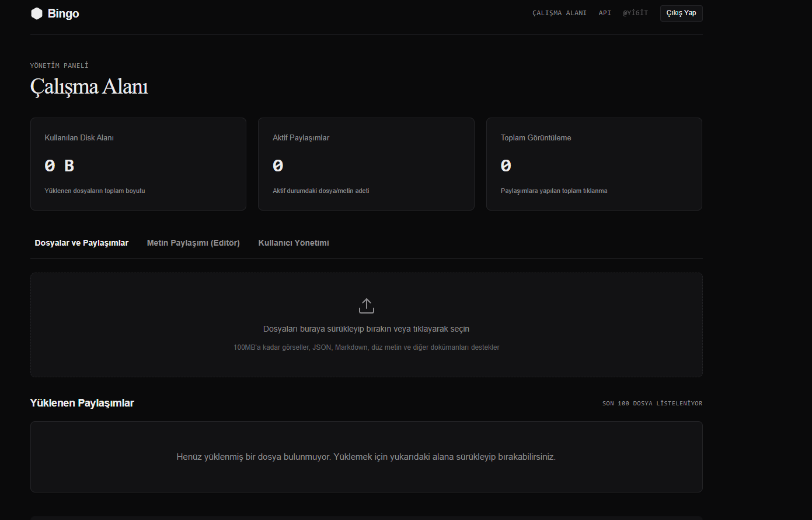

<div align="center">



# Bingo

**Minimalist, kendi sunucunuzda barındırabileceğiniz (self-hosted) dosya ve metin paylaşım platformu.**

Go standart kütüphanesiyle yazılmış, CGO barındırmayan ve <15 MB RAM ile çalışan hafif mimari.

[](https://go.dev/)
[](LICENSE)
[](https://www.docker.com/)
[](https://www.sqlite.org/)
[](https://github.com/benyigiteren/bingo/pulls)

</div>

---

## İçindekiler

- [Genel Bakış](#genel-bakış)
- [Öne Çıkan Özellikler](#öne-çıkan-özellikler)
- [Hızlı Başlangıç](#hızlı-başlangıç)
- [Yapılandırma](#yapılandırma)
- [Proje Yapısı](#proje-yapısı)
- [API Referansı](#api-referansı)
- [Güvenlik](#güvenlik)
- [Katkıda Bulunanlar](#katkıda-bulunanlar)
- [Lisans](#lisans)

---

## Genel Bakış

**Bingo**, dosya ve metinleri anında paylaşmanızı sağlayan, kaynak tüketimini en aza indiren bir self-hosted platformdur. Tarayıcı arayüzü veya API/betikler üzerinden görselleri, belgeleri ve metinleri güvenli biçimde sunar.

> **Felsefe:** Az RAM. Çok iş. Sıfır harici router bağımlılığı.

| | |
| :-- | :-- |
| **Dil** | Go (standart kütüphane only) |
| **Veri Tabanı** | SQLite — WAL modu |
| **Çalışma Zamanı Belleği** | < 15 MB |
| **CGO** | Yok (tamamen statik binary) |
| **Dağıtım** | Tek dosyalık Docker imajı / statik binary |

---

## Öne Çıkan Özellikler

- **Minimum Kaynak Tüketimi** — Harici router bağımlılığı olmadan, CGO barındırmayan ve <15 MB RAM ile çalışan hafif mimari.
- **Gömülü SQLite (WAL Modu)** — Veri tabanı `data/` altında tutulur; WAL modu sayesinde yüksek eşzamanlılıkta okuma/yazma performansı.
- **Akıllı Dosya ve Metin Yönlendirmesi**
  - **Görseller & JSON** — Doğrudan tarayıcıda ham haliyle gösterilir.
  - **Markdown (`.md`) & Düz Metin (`.txt`)** — Premium, monokrom okuyucu ekranında (`viewer`) gösterilir. `?raw=true` ile ham çıktı.
  - **Dahili Metin Editörü** — Dosya yüklemeden tarayıcı üzerinden doğrudan Markdown/düz metin yazıp paylaşma.
- **Siber Güvenlik Önlemleri**
  - **CSRF Koruması** — Web arayüzündeki tüm POST işlemlerinde session-bound CSRF token doğrulaması.
  - **Stored XSS Engelleme** — Güvensiz uzantılar (`.html`, `.svg`, `.js` vb.) zorunlu indirme (`Content-Disposition: attachment`) ile servis edilir.
  - **Rate Limiting** — IP ve API anahtarı bazlı, Token Bucket algoritmasıyla hafızada tutulan, leaksiz temizlenen hız sınırlaması.
- **Agentic AI ve API Uyumu** — API Key desteği ile dosya, JSON gövdesi veya piped düz metin yükleme.
- **Yönetici Kontrol Paneli** — Süper Yönetici tarafından kullanıcı ekleme, aktif/pasif etme, API anahtarı yenileme ve dosya izleme/silme.
- **Monokrom Minimal Tasarım** — Light/Dark sistem temalarına otomatik uyum sağlayan, göz yormayan premium CSS mimarisi.

---

## Hızlı Başlangıç

### Yöntem A — Docker Compose (Önerilen)

```bash
git clone https://github.com/benyigiteren/bingo.git
cd bingo
docker-compose up -d
```

Tarayıcınızdan `http://localhost:8080` adresine gidin. Karşınıza çıkacak **İlk Kurulum** ekranından ilk kullanıcıyı oluşturun. Bu kullanıcı **Süper Yönetici** olur ve bu işlemden sonra dışarıdan üye kayıtları tamamen kilitlenir.

### Yöntem B — Go ile Yerel Derleme

```bash
# Bağımlılıkları indir
go mod download

# Doğrudan çalıştır
go run main.go

# — veya derlenmiş binary ile —
go build -ldflags="-w -s" -o bingo main.go
./bingo
```

> Varsayılan olarak platform `:8080` portundan çalışır; veri tabanı `./data/bingo.db`, yüklenen dosyalar `./uploads/` altında saklanır.

---

## Yapılandırma

Bingo, ortam değişkenleri (env) üzerinden yapılandırılır — ek yapılandırma dosyası gerektirmez.

| Değişken | Varsayılan | Açıklama |
| :--- | :--- | :--- |
| `PORT` | `8080` | HTTP sunucusunun dinleyeceği port. |
| `DB_PATH` | `data/bingo.db` | SQLite veri tabanı dosyasının yolu. |

---

## Proje Yapısı

```
bingo/
├── main.go              # Uygulama giriş noktası ve router (Go 1.22+ mux)
├── db/                  # SQLite şeması ve CRUD işlevleri
├── middleware/          # Oturum, CSRF doğrulama ve Rate Limiter
├── handlers/            # Setup, giriş, dosya paylaşım ve API işleyicileri
├── templates/           # Türkçe HTML şablonları (Bento istatistikler, Editör, Viewer)
├── static/              # CSS ve JavaScript yardımcı dosyaları
├── Dockerfile           # Çok aşamalı (multi-stage) minimal Docker imajı
├── docker-compose.yml   # Hazır Docker Compose yapılandırması
└── .gitignore
```

---

## API Referansı

API üzerinden paylaşım yapmak için kontrol panelinizden alacağınız API anahtarını `X-API-Key` başlığında gönderin.

### 1. Dosya Yükleme (Multipart Form)

```bash
curl -X POST \
  -H "X-API-Key: bg_api_anahtariniz" \
  -F "file=@resim.png" \
  http://localhost:8080/api/upload
```

### 2. Metin Yükleme (JSON Gövdesi)

```bash
curl -X POST \
  -H "Content-Type: application/json" \
  -H "X-API-Key: bg_api_anahtariniz" \
  -d '{"text": "# Doküman\nMerhaba Bingo!", "filename": "not.md"}' \
  http://localhost:8080/api/upload
```

### 3. Ham Metin Yükleme (Pipe / Akış)

```bash
echo "Sistem log kayıtları..." | curl -X POST \
  -H "Content-Type: text/plain" \
  -H "X-API-Key: bg_api_anahtariniz" \
  --data-binary @- \
  http://localhost:8080/api/upload
```

---

## Güvenlik

Bingo, self-hosted bir hizmet olarak uçtan uca güvenlik tasarımıyla gelir:

- **CSRF** — Tüm state-changing web istekleri session-bound token ile doğrulanır.
- **XSS** — Tehlikeli uzantılar tarayıcıda yorumlanmaz; zorunlu indirme olarak servis edilir.
- **Rate Limiting** — IP ve API anahtarı bazlı Token Bucket; hafıza sızıntısız periyodik temizlik.
- **Oturum Yönetimi** — Arka planda periyodik session cleanup; süresiz/dinamik limiter temizliği.
- **İlk Kurulum Kilidi** — İlk Süper Yönetici oluşturulduktan sonra dışarıdan kayıt devre dışı kalır.

> Üretimde kullanım için: ters proxy (nginx/Caddy) arkasına alın, TLS sonlandırmasını proxy'ye bırakın ve `uploads/` ile `data/` dizinlerini yedekleyin.

---

## Katkıda Bulunanlar

Katkılar memnuniyetle karşılanır. Lütfen bir PR açmadan önce:

1. Forklayın ve bir feature branch oluşturun (`git checkout -b ozellik/yeni-ozellik`).
2. Değişikliklerinizi commit edin ([conventional commits](https://www.conventionalcommits.org/) önerilir).
3. Pull Request açın.

---

## Lisans

Bu proje açık kaynaklıdır ve **MIT Lisansı** altında dağıtılmaktadır. Dilediğiniz gibi geliştirebilir, forklayabilir ve kendi sunucunuzda barındırabilirsiniz.

<div align="center">

<sub>Built with Go · Designed for minimal footprint</sub>

</div>
