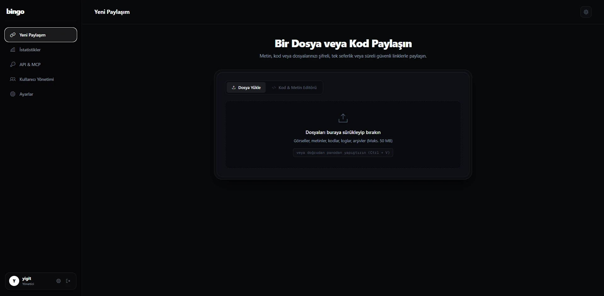

<div align="center">



# Bingo

**Gelişmiş Minimalist Pastebin, Dosya Kasası ve Evrensel MCP (Model Context Protocol) Sunucusu.**

Go standart kütüphanesiyle yazılmış, CGO barındırmayan, <15 MB RAM ile çalışan, Claude / Cursor / GPT / Gemini uyumlu modern paylaşım platformu.

[](https://go.dev/)
[](https://modelcontextprotocol.io/)
[](LICENSE)
[](https://www.docker.com/)
[](https://www.sqlite.org/)
[](https://github.com/benyigiteren/bingo/pulls)

</div>

---

## İçindekiler

- [Genel Bakış](#genel-bakış)
- [Öne Çıkan Özellikler](#öne-çıkan-özellikler)
- [Model Context Protocol (MCP) Entegrasyonu](#model-context-protocol-mcp-entegrasyonu)
  - [Cursor IDE](#cursor-ide-ile-kullanım)
  - [Claude Desktop](#claude-desktop-ile-kullanım)
  - [CLI / Stdio Modu](#yerel-cli-modu)
- [Hızlı Başlangıç](#hızlı-başlangıç)
- [Yapılandırma](#yapılandırma)
- [Proje Yapısı](#proje-yapısı)
- [API Referansı](#api-referansı)
- [Güvenlik Mimarisi](#güvenlik-mimarisi)
- [Lisans](#lisans)

---

## Genel Bakış

**Bingo**, geliştiricilerin, sistem yöneticilerinin ve yapay zeka ajanlarının (AI Agents) kod parçacıklarını, hata loglarını, markdown notlarını ve dosyaları anında paylaşabilmesi için tasarlanmış yüksek performanslı bir self-hosted platformdur.

> **Felsefe:** Az RAM (<15MB). Çok iş. Sıfır harici router bağımlılığı. Tam otonom AI uyumu.

| | |
| :-- | :-- |
| **Dil** | Go 1.22+ (Standart mux & kütüphane) |
| **Veri Tabanı** | SQLite (WAL Modu, CGO-suz `modernc.org/sqlite`) |
| **Çalışma Zamanı Belleği** | < 15 MB RAM |
| **Arayüz** | Soft-Dark Minimalist (Linear / Raycast estetiği) |
| **AI Desteği** | Model Context Protocol (MCP) JSON-RPC 2.0 (HTTP SSE & Stdio) |
| **Dağıtım** | Tek statik binary veya hafif Docker imajı |

---

## Öne Çıkan Özellikler

### 1. Gelişmiş Pastebin & Dosya Kasası (Vault)
- **Süreli Paylaşımlar (TTL)**: `10 Dakika`, `1 Saat`, `1 Gün`, `1 Hafta`, `30 Gün` veya `Süresiz`. Süresi dolan paylaşımlar arka plandaki otomatik temizleyici ile SQLite ve diskten güvenle silinir.
- **Kendini İmha Eden Paylaşımlar (Burn After Reading)**: Paylaşım bağlantısı ilk kez açılıp okunduktan hemen sonra sistemden tamamen yok edilir.
- **Parola Korumalı Paylaşım**: İsteğe bağlı bcrypt ile şifrelenmiş paylaşımlar; link açıldığında şık bir parola kilit ekranı sunar.
- **Pano (Clipboard - `Ctrl + V`) Otomatik Yakalama**: Sayfanın herhangi bir yerindeyken `Ctrl + V` yaptığınızda panodaki ekran görüntüsü veya metin otomatik algılanır ve anında yükleme/düzenleme modalı açılır.
- **Anlık Arama & Kategori Filtreleri**: Sayfa yenilenmeden çalışan hızlı arama motoru ve `Tümü`, `Kodlar`, `Belgeler`, `Görseller` filtreleri.
- **Çift Görünüm Modu**: Tek tıkla değişen ve tercihinizi hatırlayan **Liste (Tablo)** ve **Izgara (Bento Grid)** görünümü.
- **Tek Tıkla SVG QR Kod**: Mobil cihazlarla anında açmak veya dosya aktarmak için her paylaşıma özel QR kod penceresi.
- **Zengin Kod & Markdown Görüntüleyici**: 20+ programlama dili desteği, satır numaralandırma, canlı split-preview markdown editörü ve ham (raw) çıktı.

### 2. Güvenlik ve Performans
- **CSRF Koruması**: Session-bound CSRF token doğrulaması.
- **Stored XSS Koruması**: Güvensiz uzantılar zorunlu indirme (`Content-Disposition: attachment`) ile servis edilir.
- **Bellek-Sızıntısız Rate Limiter**: IP ve API anahtarı bazlı Token Bucket algoritması.
- **İlk Kurulum Kilidi**: İlk Süper Yönetici oluşturulduktan sonra dışarıdan kayıtlar tamamen kapatılır.

---

## Model Context Protocol (MCP) Entegrasyonu

Bingo, yerel veya uzak tüm AI asistanlarıyla (Claude Desktop, Cursor, Gemini, GPT, Antigravity) %100 uyumlu tam teşekküllü bir **MCP Sunucusu** olarak çalışır.

### Desteklenen MCP Araçları (Tools)
- `bingo_share_paste`: Metin/kod paylaşımı yükler (TTL, Burn ve Parola destekli) ve canlı link döndürür.
- `bingo_upload_file`: Base64 formatında görsel veya belge yükler.
- `bingo_get_paste`: Belirtilen dosyanın içeriğini AI bağlamına çeker.
- `bingo_list_pastes`: Kullanıcının son paylaşımlarını listeler.
- `bingo_search_pastes`: Paylaşımlar arasında arama yapar.
- `bingo_delete_paste`: Bir paylaşımı kalıcı olarak siler.

### Cursor IDE ile Kullanım
Cursor Settings > Features > MCP bölümünden **Add New MCP Server** butonuna tıklayın:
- **Name:** `bingo`
- **Type:** `sse`
- **URL:** `http://localhost:8080/mcp?api_key=bg_api_anahtariniz`

### Claude Desktop ile Kullanım
`claude_desktop_config.json` dosyanıza ekleyin:

```json
{
  "mcpServers": {
    "bingo": {
      "command": "npx",
      "args": ["-y", "mcp-remote", "http://localhost:8080/mcp?api_key=bg_api_anahtariniz"]
    }
  }
}
```

### Yerel CLI Modu
Bingo'yu doğrudan Stdio üzerinden çalıştırmak için:

```bash
bingo mcp --api-key="bg_api_anahtariniz"
```

---

## Hızlı Başlangıç

### Yöntem A: Docker Compose (Önerilen)

```bash
git clone https://github.com/benyigiteren/bingo.git
cd bingo
docker-compose up -d
```

Tarayıcınızdan `http://localhost:8080` adresine gidin. Karşınıza çıkacak **İlk Kurulum** ekranından ilk kullanıcıyı oluşturun. Bu kullanıcı **Süper Yönetici** olur ve kayıtlar kapatılır.

### Yöntem B: GitHub Container Registry (GHCR) ile Tek Komutta Çalıştırma

```bash
docker run -d \
  --name bingo \
  -p 8080:8080 \
  -v $(pwd)/data:/app/data \
  -v $(pwd)/uploads:/app/uploads \
  --restart unless-stopped \
  ghcr.io/benyigiteren/bingo:latest
```

### Yöntem C: Go ile Yerel Derleme

```bash
# Bağımlılıkları indir
go mod download

# Derle ve Çalıştır
go build -ldflags="-w -s" -o bingo main.go
./bingo
```

---

## Proje Yapısı

```
bingo/
├── main.go              # Giriş noktası, mux routing, TTL goroutine ve CLI MCP
├── db/                  # SQLite WAL şeması, TTL, Burn, Parola ve CRUD
├── mcp/                 # Model Context Protocol çekirdeği (JSON-RPC 2.0, Tools, SSE/Stdio)
├── handlers/            # HTTP işleyicileri, upload, share, MCP endpoint
├── middleware/          # Session yönetimi, CSRF ve Token Bucket Rate Limiter
├── templates/           # Soft-dark HTML şablonları (Dashboard, Split Editör, Viewer)
├── static/
│   ├── css/style.css    # Linear/Raycast ilhamlı modern Soft Dark CSS
│   └── js/app.js        # Ctrl+V pano dinleyicisi, filtreler, QR kod, canlı önizleme
├── Dockerfile           # Minimal multi-stage Dockerfile
└── docker-compose.yml   # Hazır Docker Compose konfigürasyonu
```

---

## API Referansı

Tüm API isteklerinde `X-API-Key: bg_...` başlığı veya `?api_key=bg_...` parametresi kullanılabilir.

### 1. Metin veya Kod Yükleme (JSON)

```bash
curl -X POST \
  -H "Content-Type: application/json" \
  -H "X-API-Key: bg_api_anahtariniz" \
  -d '{
    "text": "package main\n\nfunc main() {}",
    "filename": "server.go",
    "ttl": "1d",
    "is_burn": false,
    "password": "opsiyonel_parola"
  }' \
  http://localhost:8080/api/upload
```

### 2. Dosya Yükleme (Multipart Form)

```bash
curl -X POST \
  -H "X-API-Key: bg_api_anahtariniz" \
  -F "file=@resim.png" \
  -F "ttl=1h" \
  http://localhost:8080/api/upload
```

### 3. Boru Hattı / Ham Akış Yükleme

```bash
docker logs app | curl -X POST \
  -H "Content-Type: text/plain" \
  -H "X-API-Key: bg_api_anahtariniz" \
  --data-binary @- \
  http://localhost:8080/api/upload
```

---

## Güvenlik Mimarisi

- **Session-bound CSRF Koruması**: Web arayüzündeki tüm işlemler token ile doğrulanır.
- **XSS Engelleme**: Güvensiz dosya uzantıları inline yorumlanmaz; zorunlu indirme olarak servis edilir.
- **Otomatik TTL & Burn Temizliği**: Süresi dolan veya tek seferlik açılan tüm dosyalar diskten ve veritabanından kalıcı olarak silinir.
- **Hafıza Sızıntısız Rate Limiting**: Arka planda periyodik temizlenen Token Bucket algoritması.

---

## Katkıda Bulunma

1. Projeyi forklayın (`fork`).
2. Özellik dalı oluşturun (`git checkout -b ozellik/harika-fikir`).
3. Değişikliklerinizi commit edin (`git commit -m 'feat: harika ozellik'`).
4. Dalınıza push yapın (`git push origin ozellik/harika-fikir`).
5. Bir Pull Request açın.

---

## Lisans

Bu proje açık kaynaklıdır ve **MIT Lisansı** altında dağıtılmaktadır.

<div align="center">

<sub>Built with Go · Designed for Minimal Footprint &amp; Modern Agents</sub>

</div>
